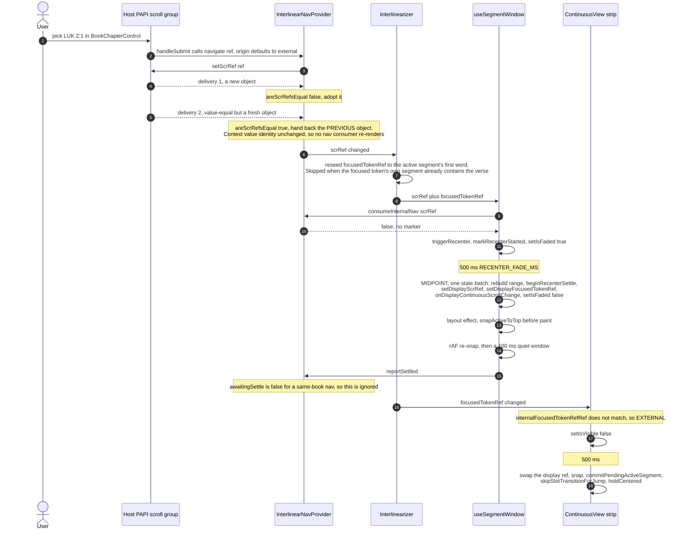
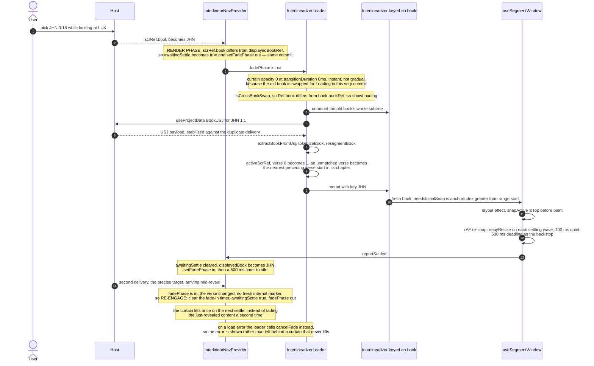
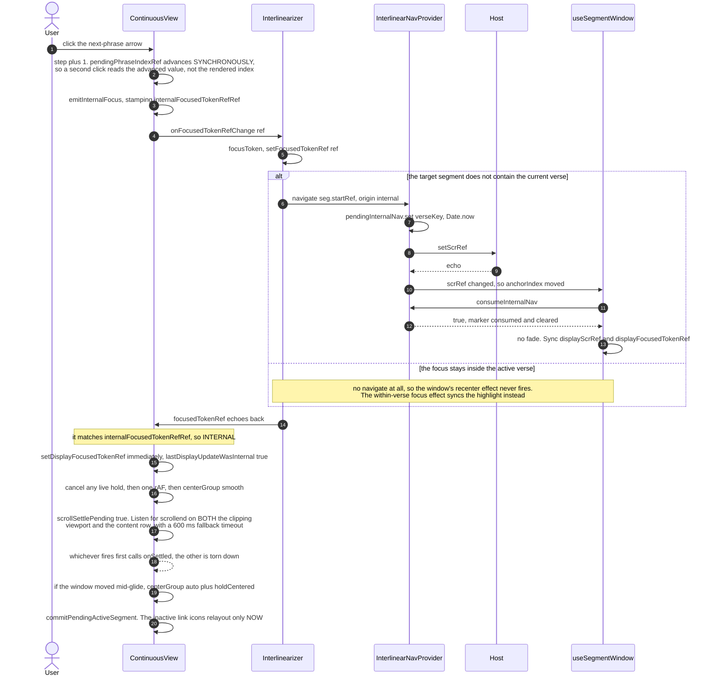
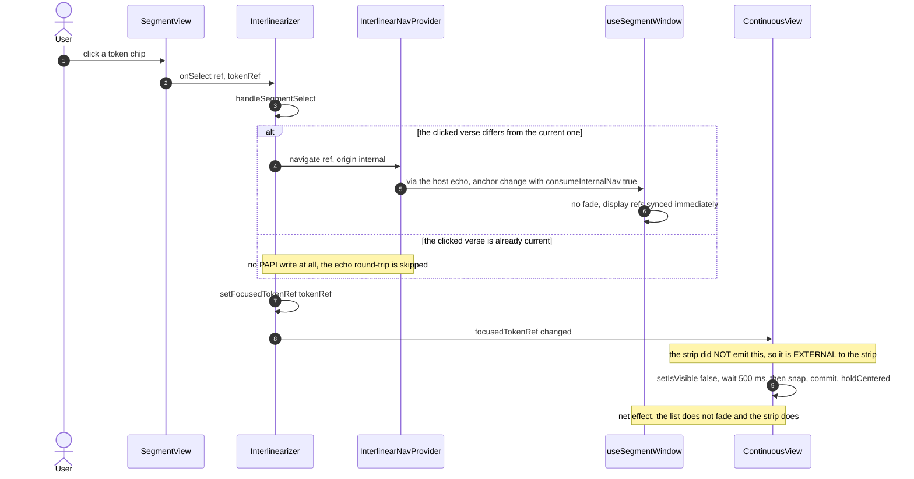
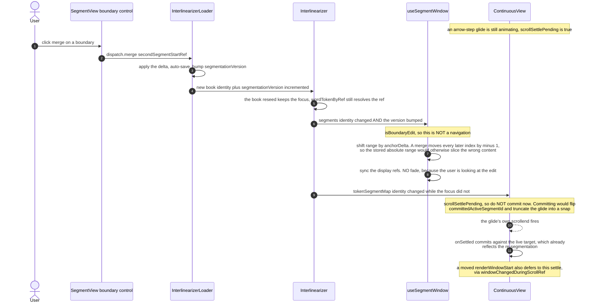
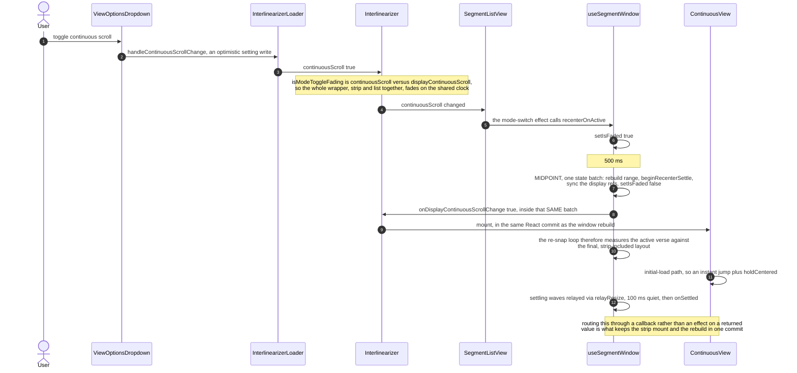

# Scenario atlas — six canonical navigations

Causality per scenario, across the five actors that matter: the host, the nav provider, the loader,
the segment window, and the strip. `interlinearizer-extension`, branch `perf/continuous-view-responsiveness` @ `0ab3de6` (unmerged).

> **Viewing:** these are mermaid `sequenceDiagram` blocks, which GitHub renders natively in the file
> view. In VS Code they need the _Markdown Preview Mermaid Support_ extension; without it the
> built-in preview shows the source as a code block.

---

## A — External navigation, same book

The baseline case, and the one that shows why the duplicate-delivery guard exists.

---

## B — Cross-book jump

The only scenario with a curtain, and the only one where a single user action arrives as two
navigations.

---

## C — Strip arrow step

The internal path. Nothing fades; everything is a glide with a deferred relayout.

---

## D — Token click in the segment list

The asymmetry worth internalising: one action, "internal" to the list and "external" to the strip.

---

## E — Boundary edit landing mid-glide

Two independent clocks colliding. The interesting part is what does _not_ happen.

---

## F — Continuous-scroll toggle

The one place where a callback is used instead of a returned value, and the reason is one React commit.

