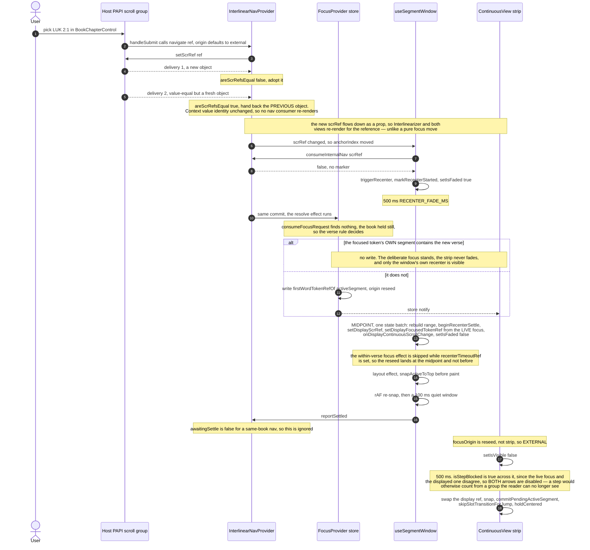
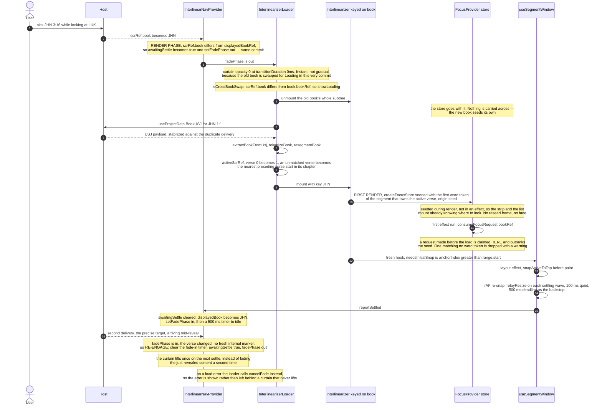
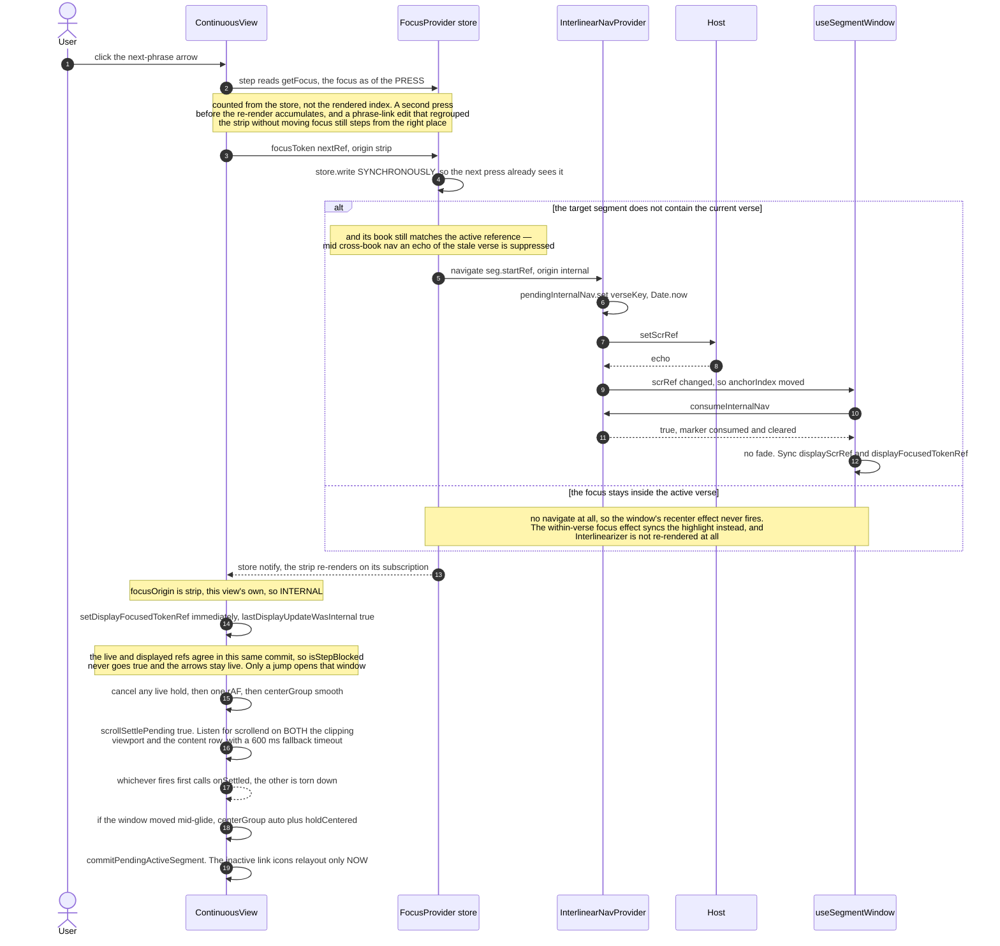
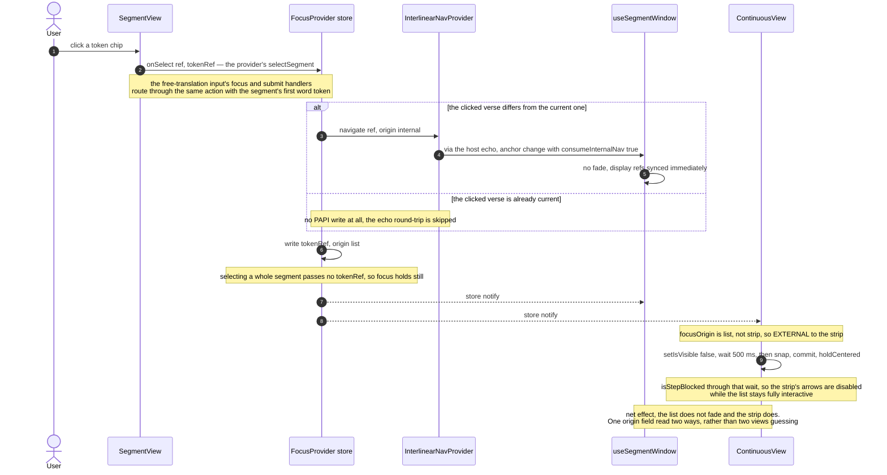
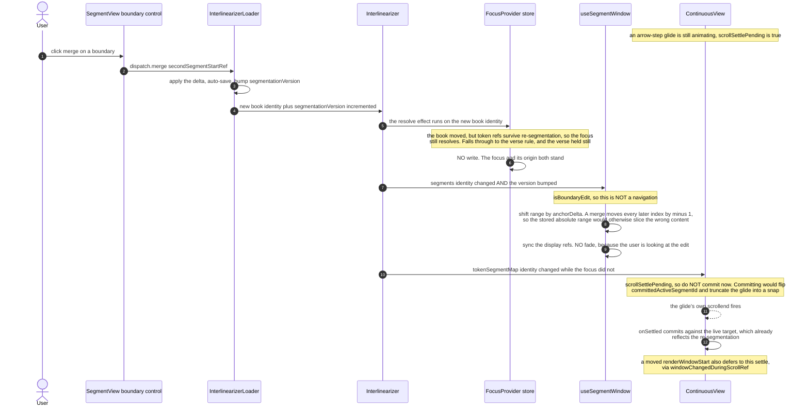
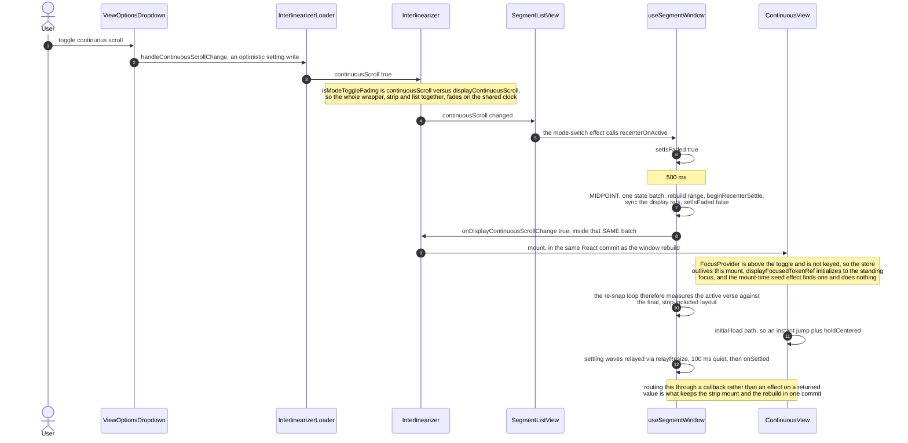

# Scenario atlas — six canonical navigations, on the focus store

Causality per scenario, across the six actors that matter: the host, the nav provider, the focus
store, the loader, the segment window, and the strip. `interlinearizer-extension`, branch
`feat/focus-store` @ `b5ffa88` (unmerged).

> **Viewing:** these are mermaid `sequenceDiagram` blocks, which GitHub renders natively in the file
> view. In VS Code they need the _Markdown Preview Mermaid Support_ extension; without it the
> built-in preview shows the source as a code block.

## What changed under these scenarios

[04-scenarios.md](04-scenarios.md) describes the same six navigations on
`perf/continuous-view-responsiveness`, where focus was `Interlinearizer` state passed down as a
prop, and each view reconstructed where a focus move came from — the strip by stamping
`internalFocusedTokenRefRef` before emitting and comparing on the way back. This branch hoists focus
into `src/components/FocusStore.tsx`. Three consequences run through every diagram below:

1. **Origin is recorded at the call site, not reconstructed.** Every write carries a `FocusOrigin` —
   `seed`, `strip`, `list`, `reseed`, or `request` — and each consumer maps origin to behavior
   itself. The strip glides for `strip` and fades for everything else; the segment window still asks
   its own, wider question through `consumeInternalNav`. The two disagreeing about one event is now
   a stated design point rather than two independent guesses that happen to differ.
2. **A focus move no longer re-renders `Interlinearizer`.** `useFocus` is a `useSyncExternalStore`
   subscription, so an arrow step wakes the strip and the list and nothing else — pinned by _leaves
   Interlinearizer unrendered by a focus move inside the active verse_ in
   `Interlinearizer.test.tsx`.
3. **The reseed rules are one ordered rule set in one effect.** Request outranks the book reseed,
   which outranks the verse reseed, so no two rules can race on which reseed wins. A write naming
   the token already focused is dropped, so a reseed resolving to the standing focus wakes nobody.

`FocusProvider` sits inside `Interlinearizer`'s fade wrapper and above both views, so the store
outlives a continuous-scroll toggle but not a book change — `Interlinearizer` is keyed on
`book.bookRef`.

---

## A — External navigation, same book

The baseline case, and the one that shows why the duplicate-delivery guard exists.

---

## B — Cross-book jump

The only scenario with a curtain, and the only one where a single user action arrives as two
navigations.

The nav provider drops an unclaimed focus request once navigation lands on a book other than the one
it names — the abandon effect depends on `scrRef.book` alone, so a verse navigation _within_ the
requested book leaves the request standing for the load that has yet to arrive.

---

## C — Strip arrow step

The internal path. Nothing fades; everything is a glide with a deferred relayout.

Entering edit or confirm-unlink mode takes the same path: the strip focuses the active phrase's
first token with origin `strip`, so the move glides rather than fading.

---

## D — Token click in the segment list

The asymmetry worth internalising: one action, `list` rather than `strip`, so a move for the view
that made it and a jump for the other.

---

## E — Boundary edit landing mid-glide

Two independent clocks colliding. The interesting part is what does _not_ happen.

When the edit _does_ strand the focus — a re-tokenization in which the focused ref no longer
resolves — the book rule fires instead and reseeds to the active verse's first word with origin
`reseed`, which the strip then reads as a jump.

---

## F — Continuous-scroll toggle

The one place where a callback is used instead of a returned value, and the reason is one React
commit.

The strip's mount-time seed effect only fires when nothing has resolved a focus at all — which
needs the active verse to own no word token. When it does fire it writes origin `seed`, and because
`seed` is not `strip` the strip reads its own naming as a jump: one `RECENTER_FADE_MS` behind the
already-invisible strip, then the instant snap and the reveal.

---

## Origin, end to end

Where each `FocusOrigin` is written, and what each side does with it.

| Origin    | Written by                                                            | Strip | Segment window                          |
| --------- | --------------------------------------------------------------------- | ----- | --------------------------------------- |
| `seed`    | `createFocusStore` at provider construction; the strip's mount effect | jump  | no navigation, so no recenter           |
| `strip`   | `focusToken` from an arrow step, phrase click, or phrase-mode entry   | glide | `consumeInternalNav` true, no fade      |
| `list`    | `selectSegment` from a click or focus in the list                     | jump  | `consumeInternalNav` true, no fade      |
| `reseed`  | the resolve effect's book and verse rules                             | jump  | external nav, fade and recenter         |
| `request` | the resolve effect claiming `consumeFocusRequest`                     | jump  | unmoved unless the caller navigates too |

Every `jump` row shares one side effect: the displayed ref lags the live focus for a
`RECENTER_FADE_MS` fade, and `isStepBlocked` disables both strip arrows across that window, so a
step can never count from a group the reader has stopped seeing. The `strip` row is the only one
that adopts the focus in the same commit, which is why rapid arrow presses still accumulate.

`request` has no production caller yet — `requestFocusToken` is exposed on the nav surface and
claimed by `FocusProvider`, but nothing in the extension calls it. If one is added, this row and
diagram 3's row 13 both need revisiting.
