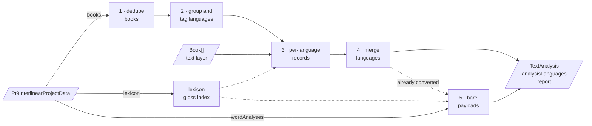

# PT9 conversion pipeline

`convertPt9Project` turns one project's Paratext 9 interlinear data into the extension's analysis
layer. It is a pure function: the platform reads and parses the XML with PT9's own semantics and
serves a `Pt9InterlinearProjectData`, and nothing in this directory touches a file. The XML behind
that payload is documented in [pt9-xml.md](../../parsers/pt9/pt9-xml.md).

> [!IMPORTANT]
> **This describes #272, and this branch is not #272.** The ten files it cites live in
> `src/converters/pt9/` on the `pt9-parsed-converter` branch; none of them exist in the tree around
> this file, and the parsers it replaces are still present under `src/parsers/pt9/`. Read it against
> that PR.

One payload arrives and splits three ways. The `books` lane is a four-step chain producing analyses
anchored to real occurrences in the text; the `wordAnalyses` lane is a single step producing
payloads that describe a spelling and carry no links. Both query the lexicon, and both converge on
one `TextAnalysis`.

## Stages

**1. Dedupe books** — `convertPt9Project.ts`

Keeps one book per gloss language and book id. Drops books carrying neither, and non-canonical
twins of a book already seen; the twin PT9's own reader loads wins.

**2. Group and tag languages** — `convertPt9Project.ts`, `glossLanguageTags.ts`

Groups the surviving books by raw `GlossLanguage` and resolves the BCP 47 tag each group's glosses
are keyed by. Drops nothing: an untaggable value passes through verbatim, flagged as a fallback.

**3. Build per-language records** — `languageAnalysisBuilder.ts`, `clusterAnchoring.ts`

Classifies and anchors one book of one language onto its text layer, resolving each lexeme's gloss,
and emits token and phrase contributions with status from the verse approval hash. Drops clusters
that classify as inert or anchor to nothing, counted by `Pt9ClusterDropReason`.

**4. Merge languages** — `analysisMerger.ts`

Folds every language's contributions into one record per token, parse, and phrase, with
`MultiString` glosses and their links. Drops nothing: genuinely conflicting parses become competing
records rather than losses.

**5. Build bare payloads** — `bareWordAnalyses.ts`

Turns `data.wordAnalyses` and the lexicon's legacy analyses into occurrence-free token analyses that
describe a spelling and carry no links. Drops empty and unparseable parses, and anything stage 4
already converted.

**The gloss index** — `pt9GlossSource.ts`

Not a stage in the chain but a lookup both lanes query: gloss text by composed entry id, sense
selection, and language. Answers `specific`, `defaultSingle`, or `none`, never replicating PT9's
guessing among several glossed senses.

Stages 4 and 5 are the only ones that mint lexicon references, and both do it through the
`Pt9LexiconResolver` seam rather than constructing refs themselves — a seam nothing in #272 or its
stack supplies, so today every reference comes out unresolved. Every stage accumulates onto the one
`Pt9ImportReport` described in `report.ts`, so what a conversion dropped is always countable.
